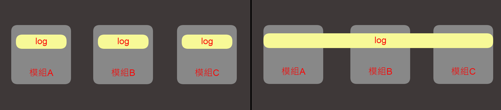

# 簡介

#### 紀錄及分享個人學習AOP的觀念及參考資料來源，內容皆為個人理解，若有錯誤請多指教。

# 使用方式

```
<dependency>
   <groupId>org.springframework.boot</groupId>
   <artifactId>spring-boot-starter-aop</artifactId>
</dependency>
```

# AOP

### 核心概念: 抽離各模組中用以處理特定領域且重複的程式碼成為一個新的模組，以橫切的方式重新使用，將其與業務邏輯解偶。



### 核心技術: Proxy Pattern (尚未研究)

### 術語:

- **Aspect: 橫切的模組**

- **Joinpoint: 執行橫切事件的地方**

- **Pointcut: 定義要執行橫切事件的地方**

- **Advice: 定義在Joinpoint要執行的事情**

- **Introduction:向現有的class添加新方法或變數**

- **Target Object: 代理對象，即為需要被切入的模組**

- **Weaving: 可以在編譯、載入或運行時完成**

# Advice Type

- **Before: 在執行方法前執行**

- **AfterReturning: 方法完成回傳後執行**

- **AfterThrowing: 在方法執行發生異常時執行**

- **After: 方法結束後執行**

- **Around:在方法前後執行自訂動作，可以決定是否執行方法，及何時用什麼方式執行方法**

# 執行順序

- **正常**
  
  * **單一 : Around -->Before -->Method -->AfterReturning -->After**
  
  * **N個 : Around(1) -->Before(1) -->Around(2) -->Before(2) --> .... -->Around(N) --> Before(N) -->Method -->AfterReturning(N) --> After(N) --> ... -->AfterReturning(2) --> After(2) -->AfterReturning(1) --> After(1)**

- 異常
  
  * **單一 : Around --> Before --> Method --> AfterThrowing --> After**
  
  * **N個 : Around(1) -->Before(1) -->Around(2) -->Before(2) --> .... -->Around(N) --> Before(N) -->Method -->AfterThrowing(N) --> After(N) --> ... -->AfterThrowing(2) --> After(2) -->AfterThrowing(1) --> After(1)**

# 參考來源

##### 1. [AOP 觀念與術語](https://openhome.cc/Gossip/SpringGossip/AOPConcept.html)

##### 2. [剖面導向程式設計 - 維基百科，自由的百科全書](https://zh.wikipedia.org/zh-tw/%E9%9D%A2%E5%90%91%E5%88%87%E9%9D%A2%E7%9A%84%E7%A8%8B%E5%BA%8F%E8%AE%BE%E8%AE%A1)

##### 3. [Spring基础 - Spring核心之面向切面编程(AOP) | Java 全栈知识体系](https://pdai.tech/md/spring/spring-x-framework-aop.html)

##### 4.[Spring AOP的最佳实践：在你的系统中记录用户的操作日志 - 掘金](https://juejin.cn/post/7062730341743591432)

##### 5.[Spring AOP Tutorial (Complete Guide 2022) | Simplilearn](https://www.simplilearn.com/tutorials/spring-tutorial/spring-aop-aspect-oriented-programming)
